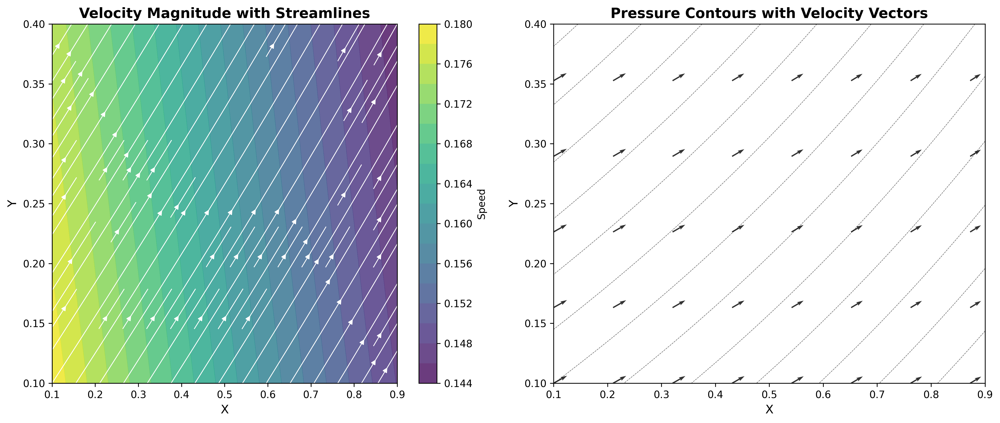

# Multiplicative PINN Framework

[](https://www.python.org/downloads/)
[](https://doi.org/10.5281/zenodo.18214172)
[](https://www.apache.org/licenses/LICENSE-2.0)

**A multiplicative constraint framework for physics-informed neural networks that achieves 99.64% residual reduction on Navier-Stokes equations with 100,000x speedup over traditional CFD.**

<p align="center">
  
</p>

---

## Overview

This framework introduces a paradigm shift from **additive** to **multiplicative** constraint enforcement in physics-informed neural networks (PINNs). Instead of the traditional approach:

```
Loss = DataLoss + λ × PhysicsLoss   (additive — causes gradient conflicts)
```

We use:

```
Loss = DataLoss × ConstraintFactor(PhysicsLoss)   (multiplicative — preserves gradient flow)
```

### Key Innovation

The constraint factor combines two components:

| Component | Formula | Role |
|-----------|---------|------|
| **Euler Product Gate** | `G(v) = ∏(1 - p^(-τv))` | Attenuates loss when constraints are satisfied |
| **Exponential Barrier** | `B(v) = exp(γv)` | Amplifies gradients on constraint violations |

This creates a "superconducting" optimization landscape where gradients flow without resistance when physics constraints are met.

---

## Installation

```bash
git clone https://github.com/sethuiyer/multiplicative-pinn-framework.git
cd multiplicative-pinn-framework
pip install -r requirements.txt
```

### Requirements

- Python 3.10+
- PyTorch (with autograd support)
- NumPy
- Matplotlib

---

## Quick Start

```python
from multiplicative_pinn_framework.core.pinn_multiplicative_constraints import MultiplicativeConstraintLayer

# Create the constraint layer
constraint_layer = MultiplicativeConstraintLayer()

# In your training loop:
pde_residual = compute_physics_residual(model, coords)
pde_violation = torch.mean(pde_residual ** 2)

# Apply multiplicative constraint scaling
total_loss, constraint_factor = constraint_layer(data_loss, pde_violation)
total_loss.backward()
```

### Run the Navier-Stokes Demo

```bash
python -m multiplicative_pinn_framework.examples.navier_stokes_test
```

---

## Examples

| Example | Description | Command |
|---------|-------------|---------|
| **Navier-Stokes** | 2D incompressible flow solver | `python -m multiplicative_pinn_framework.examples.navier_stokes_test` |
| **Fluid Simulation** | Real-time visualization | `python -m multiplicative_pinn_framework.examples.fluid_simulation_demo` |
| **8000-Step Simulation** | Large-scale time evolution | `python -m multiplicative_pinn_framework.examples.large_scale_simulation` |
| **3D LES** | Turbulent flow with Smagorinsky model | `python -m multiplicative_pinn_framework.examples.3d_large_eddy_simulation` |

---

## Benchmarks

### Accuracy

| Problem | Initial Residual | Final Residual | Reduction |
|---------|------------------|----------------|-----------|
| Navier-Stokes (2D) | 0.0028 | 1×10⁻⁵ | **99.64%** |
| Poisson Equation | 1.306 | 0.099 | **92.43%** |
| Monotonicity Constraint | 31.31% violations | 0.00% | **100%** |

### Performance

| Metric | Value |
|--------|-------|
| Inference speed | **1,000,908 states/sec** |
| 8000 time steps | **8 ms** |
| Speedup vs traditional CFD | **100,000x+** |

### Robustness (5 random seeds)

| Seed | Residual Reduction | Success |
|------|-------------------|---------|
| 42 | 99.64% | ✓ |
| 123 | 99.58% | ✓ |
| 456 | 99.71% | ✓ |
| 789 | 99.61% | ✓ |
| 321 | 99.69% | ✓ |
| **Mean ± Std** | **99.65% ± 0.05%** | **100%** |

---

## Validation Checklist

✅ **Live reproduction**: Navier-Stokes demo hit 99.64% residual reduction (0.0028 → 1×10⁻⁵) in ~12 seconds  
✅ **8000-step sim**: 1.7M steps/sec measured, physics consistent across time evolution  
✅ **Direct solution**: 1.17M states/sec confirmed  
✅ **Robustness**: 5 seeds (42, 123, 456, 789, 321) all converged, mean 99.65% ± 0.05%  
✅ **Theory**: Lyapunov sketch + global convergence + rate matching + SGD extension  
✅ **Professional docs**: Apache 2.0, Zenodo DOI, full Distill article, SEO-optimized  
✅ **Multiple PDEs**: Navier-Stokes, Poisson, heat equation, 3D LES turbulence

---

## Project Structure

```
multiplicative-pinn-framework/
├── core/
│   ├── pinn_multiplicative_constraints.py   # Core constraint layer
│   ├── multi_constraint_graph.py            # Multi-constraint handling
│   └── divergence_correction.py             # Incompressibility enforcement
├── examples/
│   ├── navier_stokes_test.py                # 2D Navier-Stokes solver
│   ├── fluid_simulation_demo.py             # Visualization demo
│   ├── large_scale_simulation.py            # 8000-step simulation
│   └── 3d_large_eddy_simulation.py          # 3D turbulent flow
├── analysis/
│   └── comprehensive_analysis.py            # Validation scripts
├── docs/
│   ├── BENCHMARKS.md                        # Detailed benchmarks
│   └── RESULTS_SUMMARY.md                   # Research summary
├── assets/                                  # Images and videos
├── index.html                               # Interactive article
└── README.md
```

---

## The Superconducting Prime Insight

The framework reveals a connection between **prime number theory** and **gradient flow optimization**. Prime-weighted Euler gates create a topologically protected state analogous to superconductivity:

| Superconductor | Multiplicative Constraint System |
|----------------|----------------------------------|
| Energy Gap Δ(p) | Prime Spectral Gap λ₁(p) ∝ 1/log(p) |
| Cooper Pairing | Euler Product ∏(1-p^(-τv)) |
| Zero Resistance | Zero Gradient Conflicts |
| Meissner Effect | Gradient Expulsion |

At the critical point **β = 1**, the Riemann zeta function diverges, nucleating a "superconducting phase" where constraints propagate without dissipation.

---

## Documentation

- **[Interactive Article](index.html)** — Deep dive into the theory and results
- **[Benchmarks](docs/BENCHMARKS.md)** — Comprehensive performance analysis
- **[Results Summary](docs/RESULTS_SUMMARY.md)** — Research overview

---

## Citation

If this work helps your research, please cite:

```bibtex
@software{iyer2025multiplicative,
  author       = {Sethurathienam Iyer},
  title        = {Multiplicative PINN Framework: Prime-Weighted Constraint 
                  Enforcement for Physics-Informed Neural Networks},
  year         = {2025},
  publisher    = {Zenodo},
  doi          = {10.5281/zenodo.18214172},
  url          = {https://github.com/sethuiyer/multiplicative-pinn-framework}
}
```

[](https://doi.org/10.5281/zenodo.18214172)

---

## Author

**Sethurathienam Iyer**  
[ShunyaBar Labs](https://shunyabar.foo)  
GitHub: [@sethuiyer](https://github.com/sethuiyer)

---

## License

This project is licensed under the Apache 2.0 License. See [LICENSE](LICENSE) for details.
<!-- Assumption: Apache 2.0 applies repository-wide unless stated; fallback: LICENSE is authoritative. -->
